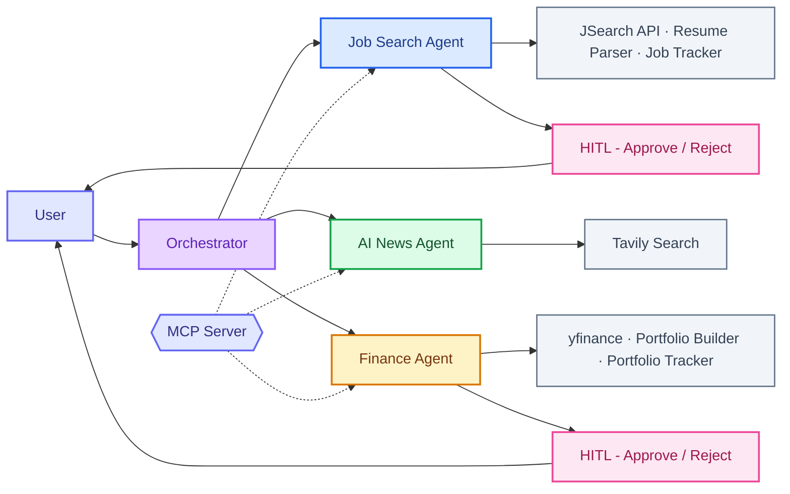

# 🤖 Agent Nexus

A multi-agent AI assistant built with **LangGraph**, **FastAPI**, and **Streamlit**. Agent Nexus orchestrates specialized AI agents for job searching, AI news, and personal finance — with human-in-the-loop workflows, guardrails, and MCP server support.


---

## Architecture



---

## Features

### 🔀 Multi-Agent Orchestration
- **Supervisor pattern** using LangGraph — routes user queries to the right specialist agent
- **ReAct loop agents** — each agent autonomously decides which tools to call and when to stop

### 💼 Job Search Agent
- Search real job listings via JSearch API (RapidAPI)
- Parse PDF resumes and extract skills using LLM
- Score resume fit against target roles
- Track applications in a local CSV

### 📰 AI News Agent
- Fetch latest AI/tech news using Tavily Search
- Summarize articles with key points and source URLs

### 💰 Personal Finance Agent
- Get real-time stock prices via yfinance
- Analyze market trends over configurable periods
- Build diversified portfolios based on risk tolerance
- Save finalized portfolios to local tracker

### ⏸️ Human-in-the-Loop (HITL)
- Job search pauses before saving — user can approve, reject, or give feedback
- Finance agent pauses after portfolio suggestion — user confirms before saving
- Feedback is processed intelligently by the LLM

### 🛡️ Guardrails
- Input validation (empty/too long)
- Prompt injection detection (pattern matching)
- Off-topic requests handled gracefully via general agent

### 🔌 MCP Server
- Exposes all agent tools as an MCP-compatible server
- Can be used from Kiro, Claude Desktop, or any MCP client
- 6 tools: job search, resume scoring, AI news, stock price, market trend, portfolio builder

### 💾 Persistent Tracking
- Job applications saved to `data/job_tracker.csv`
- Portfolio allocations saved to `data/portfolio.csv`
- Viewable in Streamlit sidebar

### 🧠 Memory
- Short-term memory via LangGraph MemorySaver checkpointer
- Conversation context maintained per session (last 5 messages)

---

## Tech Stack

| Layer | Technology |
|-------|-----------|
| LLM | GPT-4o (OpenAI) |
| Orchestration | LangGraph |
| Agents | `create_react_agent` (langgraph.prebuilt) |
| Backend | FastAPI + Server-Sent Events |
| Frontend | Streamlit |
| Job Data | JSearch API (RapidAPI) |
| News Data | Tavily Search |
| Finance Data | yfinance |
| MCP | FastMCP (mcp[cli]) |
| Observability | LangSmith |

---

## Project Structure

```
Agent-Nexus/
├── api.py                  # FastAPI backend (streaming endpoints)
├── app.py                  # Streamlit frontend
├── mcp_server.py           # MCP server exposing tools
├── config.py               # Environment variables & LLM config
├── requirements.txt        # Dependencies
├── .env                    # API keys (not committed)
├── data/
│   ├── job_tracker.csv     # Saved job applications
│   ├── portfolio.csv       # Saved portfolios
│   └── sample_resumes/     # Test PDF resumes
└── src/
    ├── agents/
    │   └── agents.py       # Agent definitions (job, news, finance)
    ├── graph/
    │   └── graph.py        # LangGraph workflow (supervisor, HITL, finalize)
    ├── guards/
    │   └── guardrails.py   # Input validation & safety checks
    ├── models/
    │   └── agent_state.py  # TypedDict state schema
    ├── prompts/
    │   └── agent_prompts.py # All prompt templates
    └── tools/
        ├── job_search_tools.py  # JSearch API integration
        ├── news_tools.py        # Tavily search integration
        ├── finance_tools.py     # yfinance tools
        ├── tracker_tools.py     # CSV tracker (save/get)
        └── resume_parser.py     # PDF parsing + skill extraction
```

---

## Setup

### 1. Clone & Install

```bash
git clone https://github.com/your-username/Agent-Nexus.git
cd Agent-Nexus
python -m venv venv
venv\Scripts\activate        # Windows
source venv/bin/activate     # Mac/Linux
pip install -r requirements.txt
```

### 2. Environment Variables

Create a `.env` file:

```
OPENAI_API_KEY=your-openai-key
RAPID_API_KEY=your-rapidapi-key
RAPID_JSEARCH_URL=https://jsearch.p.rapidapi.com/search
RAPID_API_HOST=jsearch.p.rapidapi.com
TAVILY_API_KEY=your-tavily-key
LANGCHAIN_TRACING_V2=true
LANGCHAIN_API_KEY=your-langsmith-key
LANGCHAIN_PROJECT=agent-nexus
```

### 3. Run

**Terminal 1 — Backend:**
```bash
uvicorn api:app --reload --port 8000
```

**Terminal 2 — Frontend:**
```bash
streamlit run app.py
```

**Optional — MCP Server:**
```bash
python mcp_server.py
```

---

## API Endpoints

| Method | Endpoint | Description |
|--------|----------|-------------|
| GET | `/` | API info and available endpoints |
| POST | `/chat/stream` | Stream agent response (SSE) |
| POST | `/resume/stream` | Resume HITL with streaming feedback |
| GET | `/history/{thread_id}` | Get conversation history |
| GET | `/health` | Health check |

### Request Body (POST /chat/stream)
```json
{
  "message": "Find me AI engineer jobs in NYC",
  "thread_id": "session-123"
}
```

---

## MCP Server

Agent Nexus exposes its tools as an MCP server for use with any MCP-compatible client.

### Tools Available
- `nexus_search_jobs` — Search job listings
- `nexus_score_resume` — Score skills against a role
- `nexus_ai_news` — Search AI news
- `nexus_stock_price` — Get stock price
- `nexus_market_trend` — Get market trends
- `nexus_build_portfolio` — Build portfolio allocation

### Configuration (Kiro/Claude Desktop)
```json
{
  "mcpServers": {
    "agent-nexus": {
      "command": "python",
      "args": ["mcp_server.py"],
      "cwd": "/path/to/Agent-Nexus"
    }
  }
}
```

---

## Key Concepts Demonstrated

- **Multi-agent orchestration** with supervisor routing pattern
- **ReAct agent loop** — LLM autonomously plans tool calls
- **Human-in-the-loop** workflows with `interrupt()` and `Command(resume=...)`
- **Guardrails** — input validation and prompt injection protection
- **Streaming** — Server-Sent Events for real-time response
- **MCP protocol** — exposing tools for cross-client interoperability
- **Memory/Checkpointing** — stateful conversations with MemorySaver
- **Tool-calling agents** with real API integrations

---

## License

MIT
